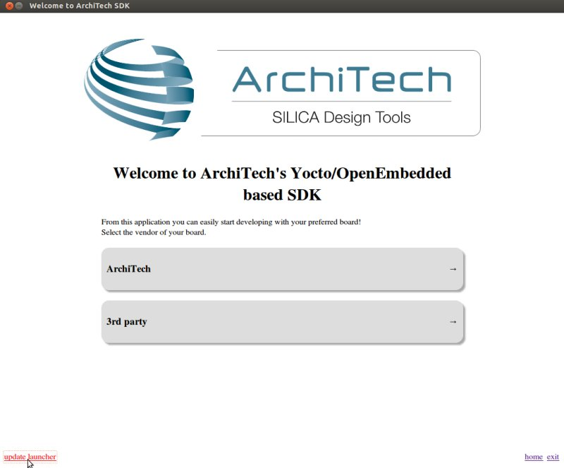
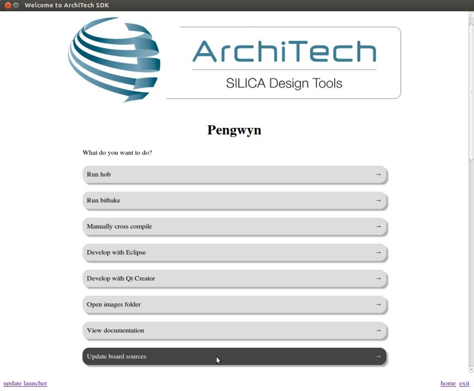

***
FAQ
***

Virtual Machine
===============

What is the password for the default user of the virtual machine?
-----------------------------------------------------------------

The password for the default user, that is **architech**, is:

.. host::

 architech

What is the password of **sudo**?
---------------------------------

The default passowrd of **architech** is **architech**. If you are searching more information about **sudo** command please refer to :ref:`sudo <sudo_info_label>` section of the :ref:`appendix <appendix_label>`.

What is the password for user root?
-----------------------------------

By default, Ubuntu 12.04 32bit comes with no password defined for **roor** user, to set it run the following
command:

.. host::

 sudo passwd root

Linux will ask you (twice, the second time is just for confirmation) to write the password for user root.

What are device files? How can I use them?
------------------------------------------

Please refer to :ref:`device files <device_files_label>` section of the :ref:`appendix <appendix_label>`.

I have problems to download the vm, the server cut down the connection
----------------------------------------------------------------------

The site has limitation in bandwith. Use download manager and do not try to speed up the download. If you try to download fastly the server will broke up your download.

Pengwyn
=======
.. _denzil_to_dora_label:

Upgrade Denzil to Dora
----------------------

The following instructions are valid only if you are using our SDK with splashscreen application.
First, if you don't know what Yocto version are you using open a terminal and launch these commands:

.. raw:: html

 

 
<b class="admonition-host">&nbsp;&nbsp;Host&nbsp;&nbsp;</b>&nbsp;&nbsp;<a style="float: right;" href="javascript:select_text( 'faq_rst-host-131' );">select</a>

 <pre class="line-numbers pre-replacer" data-start="1"><code id="faq_rst-host-131" class="language-markup">cd /home/architech/architech_sdk/architech/pengwyn/splashscreen
 git branch</code></pre>
 
 
 

If the output contains the line "* Denzil" and not "* Dora" then you are using Denzil yocto version and you can update it.
The upgrade can be easly accomplished with few clicks by the Splashscreen. This will update all the sources for this board, therefore a full re-compilation will be required.
The directories in */home/architech/architech_sdk/architech/pengwyn/* will be substituted with the new ones. The old directories will be saved in */home/architech/architech_sdk/architech/pengwyn/denzil* folder included the workspace with your projects.

.. warning::

 | Yocto **denzil** will be unusable after the update. Proceed only if you want work with **dora** version.
 | Internet connection required.

The first step is upgrade the Splashscreen application. To do this, in the main screen click on *update* link. After a while the application will be closed and reopened.

The second and last step is going to the pengwyn board screen and click on *update board*. The starting upgrade works in background, so be patient and wait the window to confirm the operation, when displayed click on **yes** to accept and insert the sudo password (default: *architech*) when the input box will appear.

This update can take even more of an hour.

.. note::

 | If you wish you can delete */home/architech/architech_sdk/architech/pengwyn/denzil* directory but be careful because there is also the workspace folder with all your projects!
