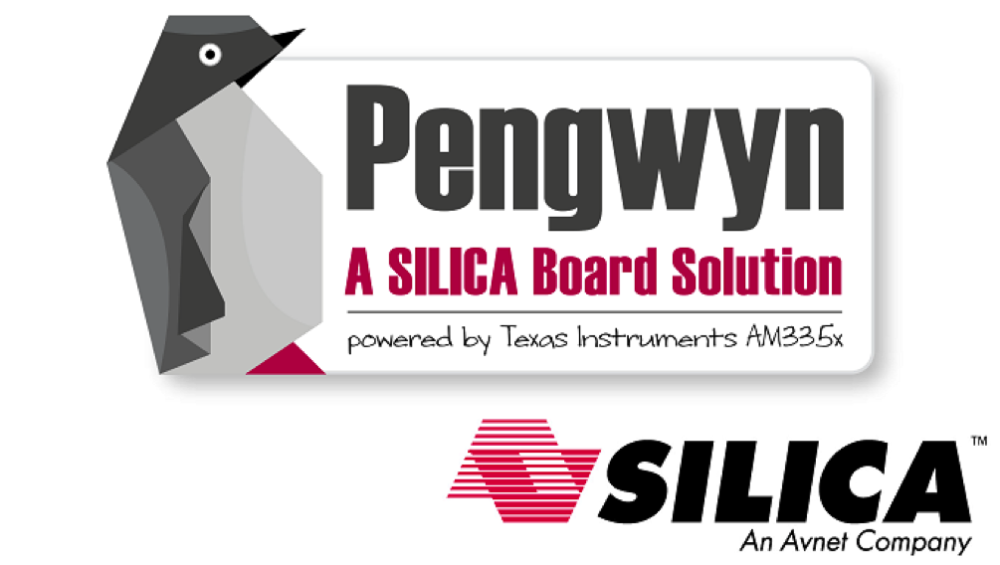

.. pengwyn-sdk documentation master file, created by
   sphinx-quickstart on Tue Mar 12 09:55:13 2013.
   You can adapt this file completely to your liking, but it should at least
   contain the root `toctree` directive.

Welcome to Pengwyn SDK's documentation!
=======================================

:Version: 1.0.1B
:Copyright: Architech
:Date: 26/06/2014

This documentation is old, you can find the last release: `Here <http://architechboards-pengwyn.readthedocs.org>`_
You can find the previous documentation: `Here <http://architechboards-pengwyn-v100.readthedocs.org>`_

.. only:: html

| This documentation is about the **Yocto based SDK** for the **Pengwyn board**.
| The SDK is provided by means of an already configured VirtualBox virtual machine, inside the virtual machine everything has already been configured for you so you don't waste time trying to understand every single detail of every single software component from the beginning.

If you are a new user of the **Yocto based SDK** we suggest you to read the :ref:`quick` chapter,
otherwise, if you want to have a better understanding of specific topics, just jump directly to
the chapter that interests you the most.

Furthermore, we encourage you to read the `official Yocto Project documentation <https://www.yoctoproject.org/documentation>`_.

Notations
=========

Throughout this guide, there are commands, file system paths, etc., that can either refer to the
machine (real or virtual) you use to run the SDK or to the board.

.. raw:: html

 

 
<b class="admonition-host">&nbsp;&nbsp;Host&nbsp;&nbsp;</b>&nbsp;&nbsp;<a style="float: right;" href="javascript:select_text( 'index_rst-host-51' );">select</a>

 <pre class="line-numbers pre-replacer" data-start="1"><code id="index_rst-host-51" class="language-markup">...</code></pre>
 
 
 

 This box will be used to refer to the machine running the SDK

.. raw:: html

 

 
<b class="admonition-board">&nbsp;&nbsp;Board&nbsp;&nbsp;</b>&nbsp;&nbsp;<a style="float: right;" href="javascript:select_text( 'index_rst-board-151' );">select</a>

 <pre class="line-numbers pre-replacer" data-start="1"><code id="index_rst-board-151" class="language-markup">...</code></pre>
 
 
 

 This box will be used to refer to Pengwyn board

However, the previous notations can make you struggle with long lines. In such a case, the following
notation is used.
 
.. raw:: html

 

 
<b class="admonition-host">&nbsp;&nbsp;Host&nbsp;&nbsp;</b>&nbsp;&nbsp;<a style="float: right;" href="javascript:select_text( 'index_rst-host-52' );">select</a>

 <pre class="line-numbers pre-replacer" data-start="1"><code id="index_rst-host-52" class="language-markup">This Box will be used where long lines need to be displayed, as well as with system paths, commands, configuration files, etc.
 All related to the host.
 It will be used to display code example as well.</code></pre>
 
 
 

.. raw:: html

 

 
<b class="admonition-board">&nbsp;&nbsp;Board&nbsp;&nbsp;</b>&nbsp;&nbsp;<a style="float: right;" href="javascript:select_text( 'index_rst-board-152' );">select</a>

 <pre class="line-numbers pre-replacer" data-start="1"><code id="index_rst-board-152" class="language-markup">The same facility will be used, when needed, for the board.</code></pre>
 
 
 

If you click on *select* on the top right corner of these two last boxes, you will get the text inside the box selected.
We have to warn you that your browser might select the line numbers as well, so, the first time you use such a feature,
you are invited to check it.

Sometimes, when referring to file system paths, the path starts with **/path/to**. In such a case, the documentation is **NOT**
referring to a physical file system path, it just means you need to read the path, understand what it means, and understand
what is the proper path on your system. For example, when referring to the device file associated to your USB flash memory you
could read something like this in the documentation:

.. raw:: html

 

 
<b class="admonition-host">&nbsp;&nbsp;Host&nbsp;&nbsp;</b>&nbsp;&nbsp;<a style="float: right;" href="javascript:select_text( 'index_rst-host-53' );">select</a>

 <pre class="line-numbers pre-replacer" data-start="1"><code id="index_rst-host-53" class="language-markup">/path/to/your/USB/device</code></pre>
 
 
 

Since things are different from one machine to another, you need to understand its meaning and corresponding value for your
machine, like for example:

.. raw:: html

 

 
<b class="admonition-host">&nbsp;&nbsp;Host&nbsp;&nbsp;</b>&nbsp;&nbsp;<a style="float: right;" href="javascript:select_text( 'index_rst-host-54' );">select</a>

 <pre class="line-numbers pre-replacer" data-start="1"><code id="index_rst-host-54" class="language-markup">/dev/sdb</code></pre>
 
 
 

otherwise, if you want to have a better understanding of specific topics, we suggest you to have a look to the documentation chapters:

.. toctree::
  :titlesonly:

  vm
  poky
  uboot
  kernel
  sdcard
  nand
  hob
  remote
  eclipse
  qt
  hardware
  opkg
  touch

.. toctree::
  :hidden:

  quick
  faq

Furthermore, we encourage you to read:

* `the official Yocto Project documentation <https://www.yoctoproject.org/documentation>`_,
* `the official Eclipse documentation <http://help.eclipse.org/indigo/index.jsp>`_, and
* `the official Qt Creator documentation <http://doc.qt.digia.com/qtcreator-2.4/>`_.

 :ref:`search`
