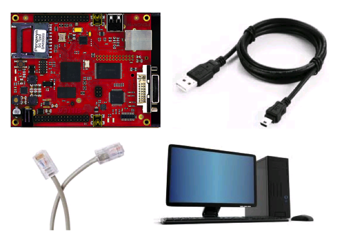

Introduction
============

This guide explains how to start developing with the Pengwyn in a few steps. 

In the following chapters you will learn step by step how to install the SDK and connect the Pengwyn on the development computer.

This SDK runs under Ubuntu 10.4 LTS and it’s based on Sitara SDK. 

After the host configuration you will see:

- how to compile the essential firmware: the bootloader and the kernel
- how to create a basic file system and save it on a sd-card.
- how use the development environment Code Composer Studio v5 for creating a basic project, compiling and debugging it

Basic knowledge of Linux system, specifically Ubuntu, is required. 

Platforms
---------

Sitara SDK supports different platforms.

    ========    ======  ===========     =======     ======      =========   ==============
    Platform    SDK     PSP             U-Boot      Kernel      Toolchain   Release Date
    ========    ======  ===========     =======     ======      =========   ==============
    Pengwyn     5.06    04.06.00.09     2012.10     3.2         Gcc4.5.3    December 2012
    ========    ======  ===========     =======     ======      =========   ==============

You can get information about the other platforms at:kk

    ======================  ================================================================================================     =================================
    Platform                Document EVM                                                                                         Provider
    ======================  ================================================================================================     =================================
    AM335xEVM               `AM335xEVM <http://processors.wiki.ti.com/index.php/AM335x_General_Purpose_EVM_HW_User_Guide/>`_     http://www.ti.com/
    AM335x StarterKit (SK)  http://processors.wiki.ti.com/index.php/AM335xStarterKitHardwareUsersGuide                           http://www.ti.com/tool/tmdssk3358
    ======================  ================================================================================================     =================================

Hardware requirements
---------------------

- Pengwyn board 
- Ethernet cable
- Mini-USB type B cable 
- Windows or Linux Host PC with at least 1GB (2GB recommended) of RAM and 40GB of free hard drive space

How to connect the board
------------------------

Connect the USB cable to the host PC.

Create an Ethernet connection between Pengwyn and the board, in the way that these devices will be on the same LAN. 

A possible configuration is showed below.
    
.. image:: /_static/boardconnection.png
   
Linux System has been pre-flashed on the board. 

If you turn on the Pengwyn and the display expansion board is connected the “Matrix Application Launcher v2” will appear.

.. image:: /_static/TIMatrix.png

   