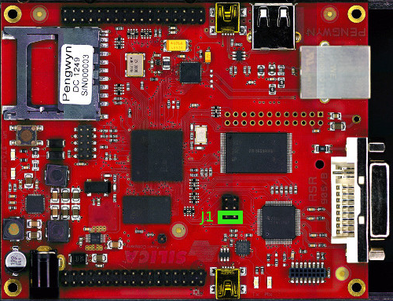

.. index:: NAND memory

How to write the NAND memory
============================

This section will explain how to transfer the data from the :index:`sd card` to the Pengwyn board :index:`flash memory`.

* Download tool scripts (download link `pengwyn-tools.tar.bz2 <_static/pengwyn-tools.tar.bz2>`_) and decompress in a folder. eg:

.. raw:: html

 

 
<b class="admonition-host">&nbsp;&nbsp;Host&nbsp;&nbsp;</b>&nbsp;&nbsp;<a style="float: right;" href="javascript:select_text( 'nand_rst-host-121' );">select</a>

 <pre class="line-numbers pre-replacer" data-start="1"><code id="nand_rst-host-121" class="language-markup">tar -jxf pengwyn-tools.tar.bz2 -C /home/architech/Desktop</code></pre>
 
 
 

Here you can find the tool **create-nand-fs.sh**

Follow these steps:

* :ref:`Connect the Pengwyn board to the PC <usbSerial>`
* Remove :index:`jumper` :index:`J1` 

* Insert the already prepared SD card in the Pengwyn board socket
* Reset the board by means of button :index:`S1`

.. image:: _static/pengwynS1.png

* Press any key when U-Boot says **Hit any key to stop autoboot**

* Erase and upload the FLASH memory with the commands

.. raw:: html

 

 
<b class="admonition-board">&nbsp;&nbsp;Board&nbsp;&nbsp;</b>&nbsp;&nbsp;<a style="float: right;" href="javascript:select_text( 'nand_rst-board-201' );">select</a>

 <pre class="line-numbers pre-replacer" data-start="1"><code id="nand_rst-board-201" class="language-markup">nand erase.chip
 run nandupdate</code></pre>
 
 
 

* Wait until the NAND write completes, than restart the board with the command

.. raw:: html

 

 
<b class="admonition-board">&nbsp;&nbsp;Board&nbsp;&nbsp;</b>&nbsp;&nbsp;<a style="float: right;" href="javascript:select_text( 'nand_rst-board-202' );">select</a>

 <pre class="line-numbers pre-replacer" data-start="1"><code id="nand_rst-board-202" class="language-markup">reset</code></pre>
 
 
 

* Wait until U-Boot and Linux initialize the system, than insert **root** as login when required (there is no password)
* Create the flash file system with the automated script:

.. raw:: html

 

 
<b class="admonition-board">&nbsp;&nbsp;Board&nbsp;&nbsp;</b>&nbsp;&nbsp;<a style="float: right;" href="javascript:select_text( 'nand_rst-board-203' );">select</a>

 <pre class="line-numbers pre-replacer" data-start="1"><code id="nand_rst-board-203" class="language-markup">./create-nand-fs.sh</code></pre>
 
 
 

* When UBIFS is unmounted, shutdown linux with the command:

.. raw:: html

 

 
<b class="admonition-board">&nbsp;&nbsp;Board&nbsp;&nbsp;</b>&nbsp;&nbsp;<a style="float: right;" href="javascript:select_text( 'nand_rst-board-204' );">select</a>

 <pre class="line-numbers pre-replacer" data-start="1"><code id="nand_rst-board-204" class="language-markup">shutdown -h now</code></pre>
 
 
 

* When the system has been halted, remove the SD card, insert the jumper in J1 and reset the board with button S1.

The system will now restart from NAND flash with the new operating system.