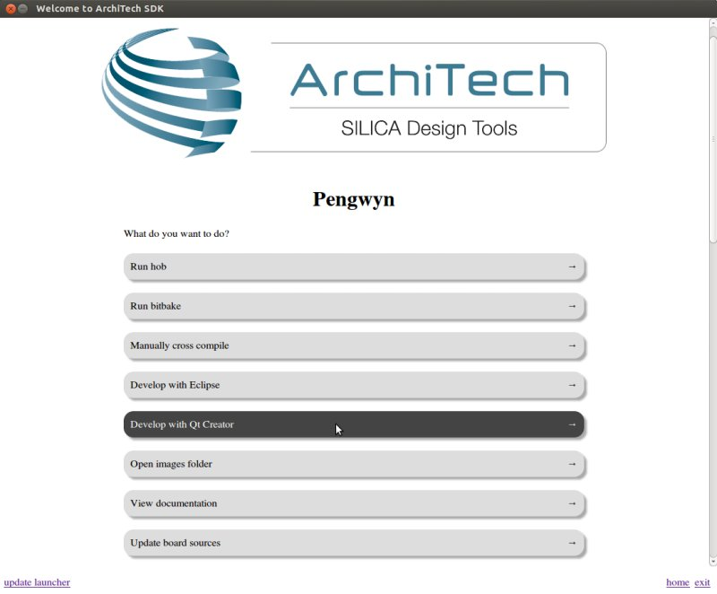
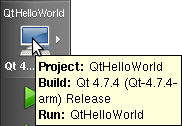
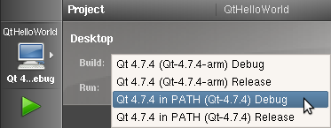
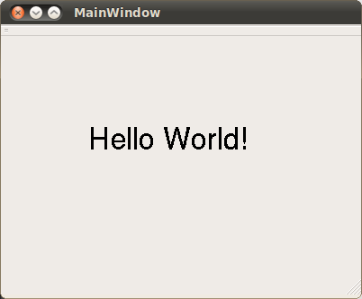
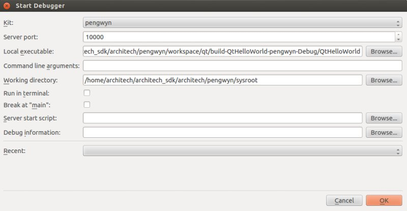
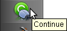

Qt SDK
======

.. image:: _static/qt-0.png
 :align: left

| **Qt** is a cross-platform application framework that is used for developing application software with a graphical user interface (GUI). 
| **Qt Creator** is a cross-platform C++ IDE, it includes a visual debugger and an integrated GUI layout and forms designer. 
| The versions used in this SDK are **Qt SDK 4.7.4** and **Qt Creator 2.4.0**.
| It is possible to compile applications for **x86** and **ARM** processors. 
| You can debug the program on the virtual machine or on Pengwyn Board.
|

.. note::

 Before reading this Chapter you should be able to use HOB, bitbake, and minicom (or a similar program).

Build image with qt
-------------------

1. With HOB or bitbake build **qt4e-demo-image**. To see how to do this, refer to :ref:`howToUseHOB` and/or :ref:`howToUsePoky` Chapters.

2. Once the image has been built (and assuming your current build directory is */home/architech/architech_sdk/architech/pengwyn/yocto/build/*), run the following commands:

.. raw:: html

 

 
<b class="admonition-host">&nbsp;&nbsp;Host&nbsp;&nbsp;</b>&nbsp;&nbsp;<a style="float: right;" href="javascript:select_text( 'qt_rst-host-71' );">select</a>

 <pre class="line-numbers pre-replacer" data-start="1"><code id="qt_rst-host-71" class="language-markup">cd /home/architech/architech_sdk/architech/pengwyn/sysroot/
 sudo rm -rf *
 cp /home/architech/architech_sdk/architech/pengwyn/yocto/build/tmp/deploy/images/qt4e-demo-image-pengwyn.tar.gz .
 sudo tar -xzf qt4e-demo-image-pengwyn.tar.gz</code></pre>
 
 
 

3. Open file */home/architech/architech_sdk/architech/pengwyn/sysroot/etc/inittab* and comment line 41:

.. raw:: html

 

 
<b class="admonition-host">&nbsp;&nbsp;Host&nbsp;&nbsp;</b>&nbsp;&nbsp;<a style="float: right;" href="javascript:select_text( 'qt_rst-host-72' );">select</a>

 <pre class="line-numbers pre-replacer" data-start="1"><code id="qt_rst-host-72" class="language-markup"># 1:2345:respawn:/sbin/getty 38400 tty1</code></pre>
 
 
 

this allows a USB keyboard to be seen by your Qt application. 

4. We don't need the qt demo application to start at boot, run the following command:

.. raw:: html

 

 
<b class="admonition-host">&nbsp;&nbsp;Host&nbsp;&nbsp;</b>&nbsp;&nbsp;<a style="float: right;" href="javascript:select_text( 'qt_rst-host-73' );">select</a>

 <pre class="line-numbers pre-replacer" data-start="1"><code id="qt_rst-host-73" class="language-markup">sudo rm /home/architech/architech_sdk/architech/pengwyn/sysroot/etc/init.d/qt4demo</code></pre>
 
 
 

Hello World!
------------

The purpose of this example project is to generate a form with an "Hello World" label in it, at the beginning on the x86 virtual machine and than on the Pengwyn board.

To create the project follow these steps:

1. Launch Qt Creator from the Architech Splashscreen just clicking on **Develop with Qt Creator**

2. Go to *File -> Open File or Project* to open **QtHelloWorld.pro** file located in *~/architech_sdk/architech/pengwyn/workspace/qt/QtHelloWorld/* directory.

3. Click on "QtHelloWorld" icon to open project menu.

4. Select the build configuration: **Qt 4.7.4 (Qt-4.7.4) Debug**.

5. To build the project, click on the bottom-left icon.

.. image:: _static/qt-3.png

6. Once you built the project, click on the green triangle to run it.

.. image:: _static/qt-4.png

7. Congratulations! You just built your first Qt application for x86.

In the next section we will debug our Hello World! application directly on Pengwyn.

Debug Hello World project on pengwyn board
------------------------------------------

8. Select build configuration: **Qt 4.7.4 (Qt-4.7.4-arm) Debug** and build the project.

.. image:: _static/qt-10.png

9. Copy the generated executable to *~/architech_sdk/architech/pengwyn/sysroot/home/root*.

.. raw:: html

 

 
<b class="admonition-host">&nbsp;&nbsp;Host&nbsp;&nbsp;</b>&nbsp;&nbsp;<a style="float: right;" href="javascript:select_text( 'qt_rst-host-74' );">select</a>

 <pre class="line-numbers pre-replacer" data-start="1"><code id="qt_rst-host-74" class="language-markup">sudo cp ~/architech_sdk/architech/pengwyn/workspace/qt/QtHelloWorld-build-desktop-Qt_4_7_4__Qt-4_7_4-arm__Debug/QtHelloWorld ~/architech_sdk/architech/pengwyn/sysroot/home/root</code></pre>
 
 
 

10. Copy all files from *~/architech_sdk/architech/pengwynsysroot* to *rootfs* of the sdcard.

.. raw:: html

 

 
<b class="admonition-host">&nbsp;&nbsp;Host&nbsp;&nbsp;</b>&nbsp;&nbsp;<a style="float: right;" href="javascript:select_text( 'qt_rst-host-75' );">select</a>

 <pre class="line-numbers pre-replacer" data-start="1"><code id="qt_rst-host-75" class="language-markup">sudo cp -r * /media/path/to/rootfs</code></pre>
 
 
 

Then turn on the pengwyn board.

11. Use minicom to launch gdbserver application on the target board:

.. raw:: html

 

 
<b class="admonition-board">&nbsp;&nbsp;Board&nbsp;&nbsp;</b>&nbsp;&nbsp;<a style="float: right;" href="javascript:select_text( 'qt_rst-board-161' );">select</a>

 <pre class="line-numbers pre-replacer" data-start="1"><code id="qt_rst-board-161" class="language-markup">gdbserver :10000 QtHelloWorld -qws</code></pre>
 
 
 

12. | In Qt Creator, open the source file main.cpp and set a breakpoint at line 6. 
    | To do this go with the mouse at line 6 and click with the right button to open the menu, select **Set brackpoint at line 6**

.. image:: _static/qt-6.png

13. Go to *Debug→Start Debugging→Attach To Remote Debug Server*, a form named "Start Debugger" will appear, insert the following data:

- Debugger: **/opt/poky/1.2.1/sysroots/i686-pokysdk-linux/usr/bin/armv5te-poky-linux-gnueabi/arm-poky-linux-gnueabi-gdb**

- Local executable: **/home/architech/architech_sdk/architech/pengwyn/workspace/qt/QtHelloWorld-build-desktop-Qt_4_7_4__Qt-4_7_4-arm__Debug/QtHelloWorld**

- Host and port: **192.168.0.10:10000**

- Architecture: **arm**

- GNU target: **auto**

- Sysroot: **/home/architech/architech_sdk/architech/pengwyn/sysroot**

Press **OK** button to start the debug.

.. image:: _static/qt-8.png

14. The hotkeys to debug the application are:

- **F10**: Step over

- **F11**: Step into

- **Shift + F11**: Step out

- **F5**: Continue, or press this icon:

15. To successfully exit from the debug it is better to close the graphical application from the target board with the mouse by clicking on the 'X' symbol. 