.. _quick:

Quick start guide
=================

This document will guide you from importing the virtual machine to the debugging of an Hello World! example on a customized Linux distribution that you will generate with the Yocto toolchain.

Installing the Virtual Machine
==============================

The development environment is provided as a virtual disk (to be used by a VirtualBox virtual machine)
which you can download from this page:

.. important::

 http://downloads.architechboards.com/sdk/virtual_machine/download.html

.. important::

 Compute the MD5SUM value of the zip file you downloaded and compare it to the golden one you find in the download page.

Uncompress the file, and you will get a *.vdi* file that is our virtual disk image.
The environment contains the SDK for all the boards provided by Architech, Pengwyn included.

Download VirtualBox
-------------------

.. image:: _static/vdi_virtualbox_logo.png
   :align: left

For being able to use it, you first need to install **VirtualBox** (version 4.2.10 or higher).
You can get VirtualBox installer from here:

https://www.virtualbox.org/wiki/Downloads

Download the version that suits your host operating system. You need to download and install the **Extension Pack** as well.

.. important::
 Make sure that the extension pack has the same version of VirtualBox.

Install the software with all the default options. 

Create a new Virtual Machine
----------------------------

1. Run VirtualBox

.. image:: _static/vdi_open_virtualbox.png
    :align: center

2. Click on *New* button

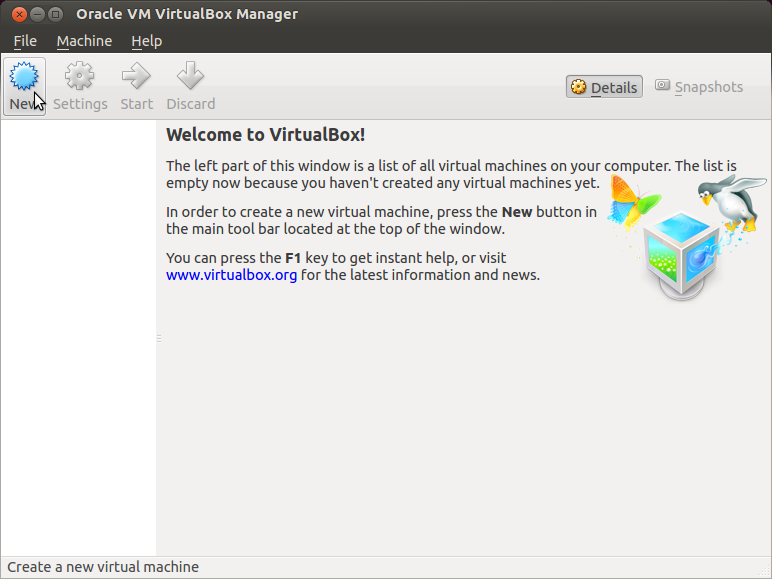

3. Select the name of the virtual machine and the operating system type

.. image:: _static/vdi_virtual_machine_name.png
    :align: center

4. Select the amount of memory you want to give to your new virtual machine

.. image:: _static/vdi_virtual_machine_memory.png
    :align: center

5. Make the virtual machine use Architech's virtual disk by pointing to the downloaded file. Than click on *Create*.

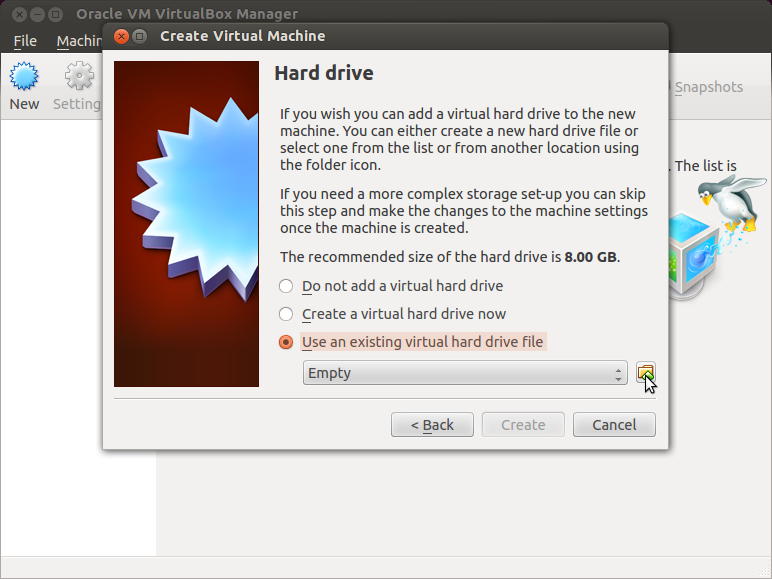

Setup the network
-----------------

We need to setup a port forwarding rule to let you (later) use the virtual machine as a local repository of packages.

.. note::

 The virtual machine must be off

1. Select Architech's virtual machine from the list of virtual machines

.. image:: _static/vdi_machine_listed.png
    :align: center

2. Click on *Settings*

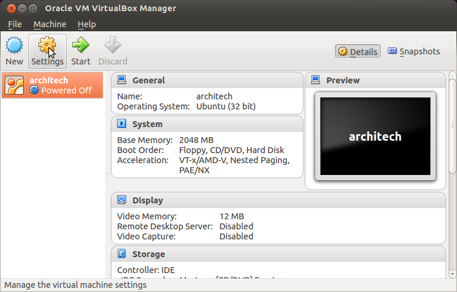

3. Select *Network*

.. image:: _static/vdi_network.png
    :align: center

4. Expand *Advanced* of *Adapter 1*

.. image:: _static/vdi_network_nat_advanced.png
    :align: center

5.  Click on *Port Forwarding*

.. image:: _static/vdi_network_nat_port_forwarding.png
    :align: center

6. Add a new *rule*

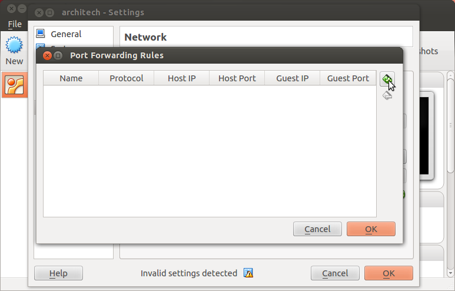

7. Configure the *rule*

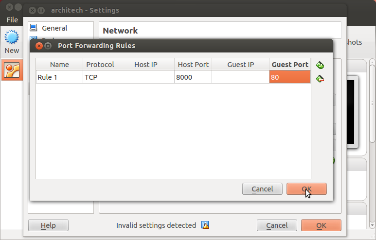

8. Click on *Ok*

Customize the number of processors
----------------------------------

Building an entire system from the ground up is a business that can take up to several hours.
To improve the performances of the overall build process, you can, if your computer has enough resources, assign more than one
processor to the virtual machine.

.. note::

 The virtual machine must be off

1. Select Architech's virtual machine from the list of virtual machines

.. image:: _static/vdi_machine_listed.png
    :align: center

2. Click on *Settings*

3. Select *System*

4. Select *Processor*

5. Assign the number of processors you wish to assign to the virtual machine

.. image:: _static/vdi_change_number_of_processors.png
    :align: center

If you changed the number of processors, you might want to consider reading the guides on how to speedup the build process for :ref:`Poky <pokySpeedup>` and :ref:`HOB <hobSpeedup>`.

Create a shared folder
----------------------

A shared folder is way for host and guest operating systems to exchange files by means of the file system.
You need to choose a directory on your host operating system to share with the guest operating system.

.. note::

 The virtual machine must be off

1. Select Architech's virtual machine from the list of virtual machines

.. image:: _static/vdi_machine_listed.png
    :align: center

2. Click on *Settings*

3. Select *Shared Folders*

4. Add a new shared folder

.. image:: _static/vdi_add_shared_folder.png
    :align: center

5. Choose a directory to share on your host machine. Make sure *Auto-mount* is selected.

.. image:: _static/vdi_new_shared_folder.png
    :align: center

Once the virtual machine has been booted, the shared folder will be mounted under */media/* directory inside the virtual machine.

The welcome screen
------------------

The splash screen application has been designed to facilitate the access to the boards tools. It can be opened by clicking on its *Desktop* icon.

.. image:: _static/run_architech.jpg

Once started, you can can choose if you want to work with Architech’s boards or with partners’ ones. For Pengwyn, choose **ArchiTech**.

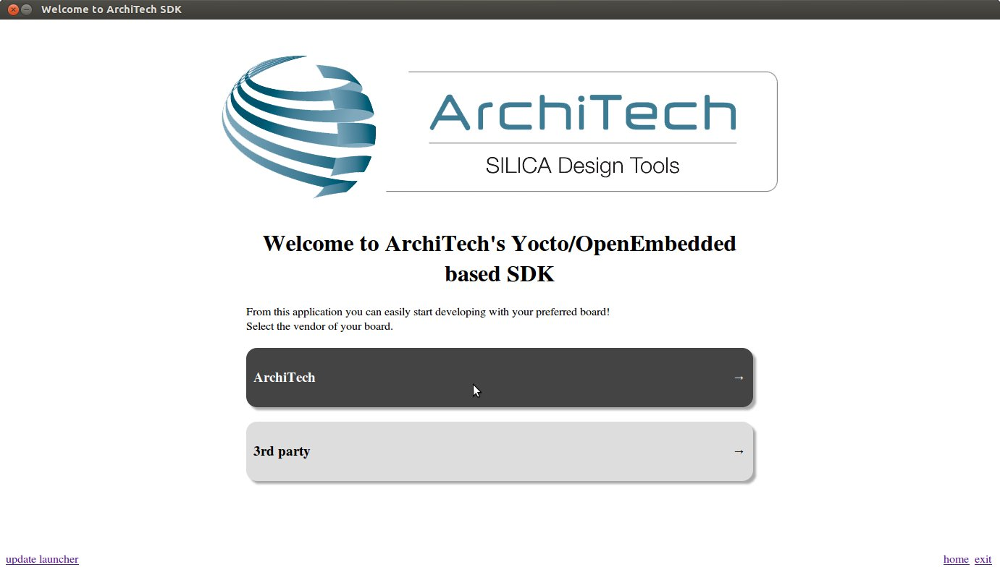

A list of all available Architech’s boards will open, select Pengwyn.

.. image:: _static/selectBoard.jpg

A list of actions related to Pengwyn that can be activated will appear.

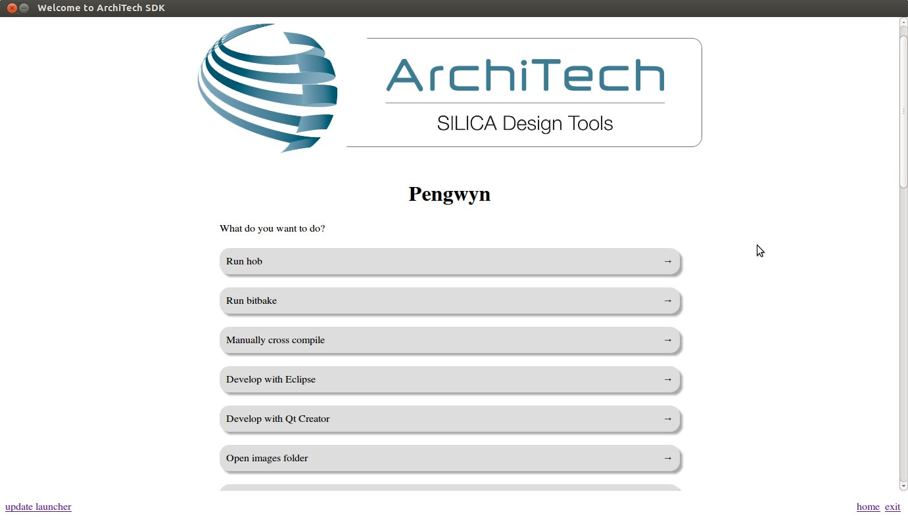

Let's build the system
----------------------

First of all you need to build a system, in this section you will build a predefined Linux image.

By clicking **Run hob** you will launch HOB.

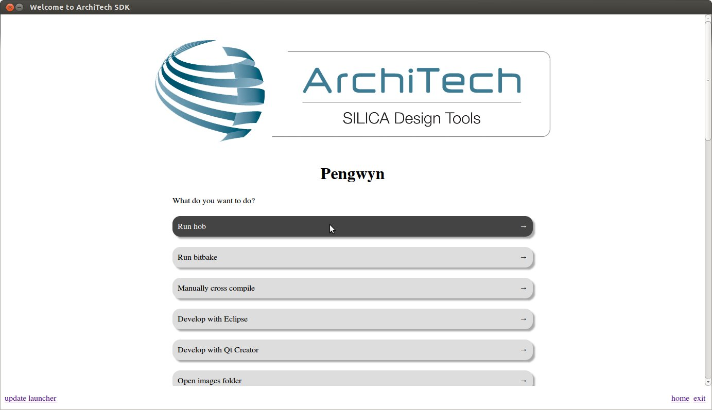

.. important::
	To run HOB you need a working Internet connection.
	If internet connection doesn't work you have to follow this instructions:

	1. Click with the right button of the mouse on the ethernet icon on the top right of the screen

	2. Select **Edit Connections...**

	.. image:: _static/ip-1.png

	3. In the wired tab select "wired connection" and press **Edit** button

	4. With another PC go to this web page: **http://www.opendns.com/opendns-ip-addresses** and copy the two IPs

	5. Go in the **IPv4 Settings** tab and write in **DNS Servers** text box the two IPs that you have copied

	If required the sudo password is **pengwyn**

Select **pengwyn** as current machine from the drop-down menu.

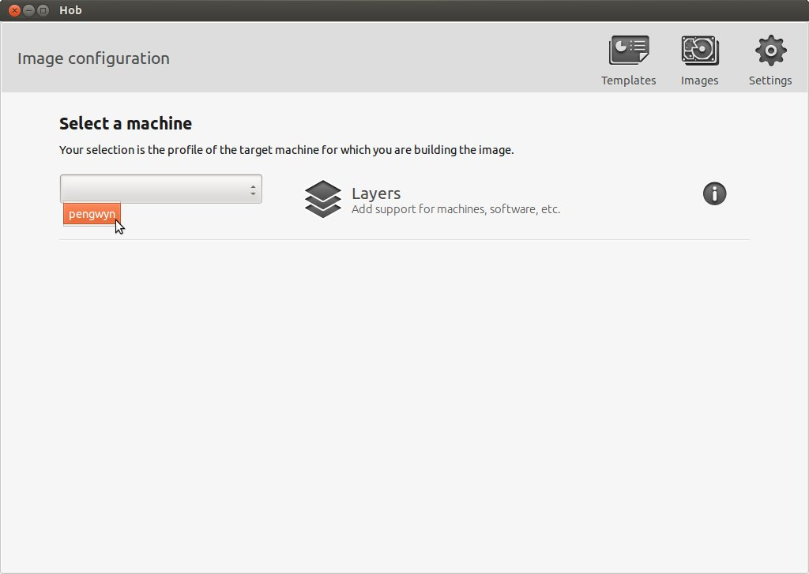

Select **core-image-minimal-dev** as base image.

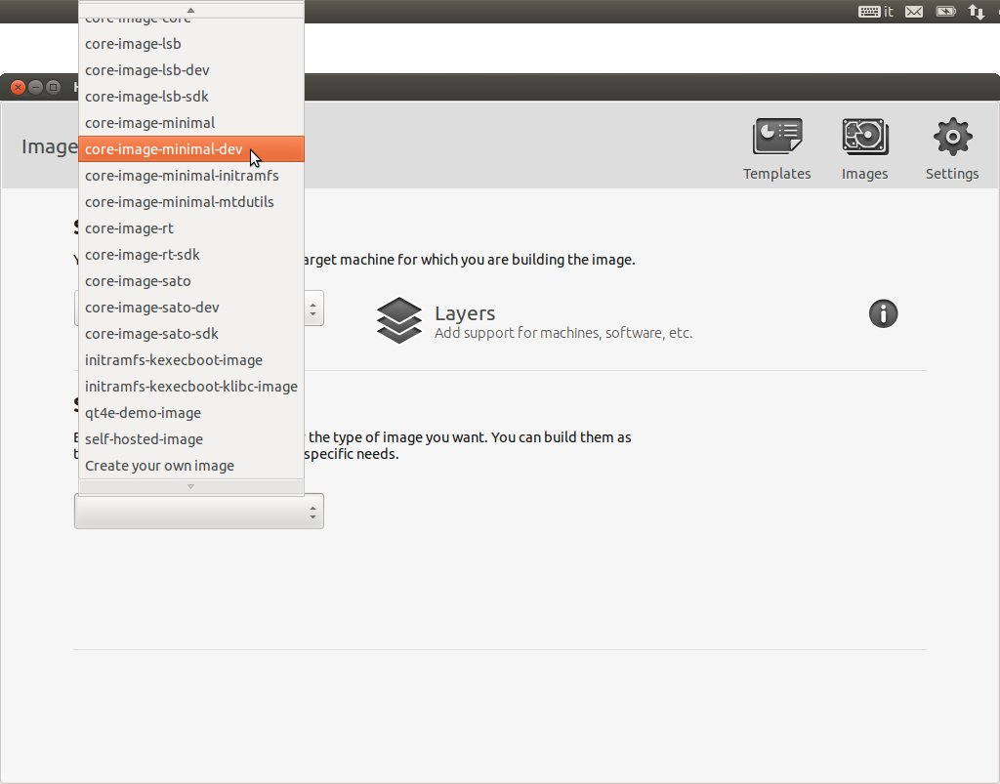

Click on **Build image** button.

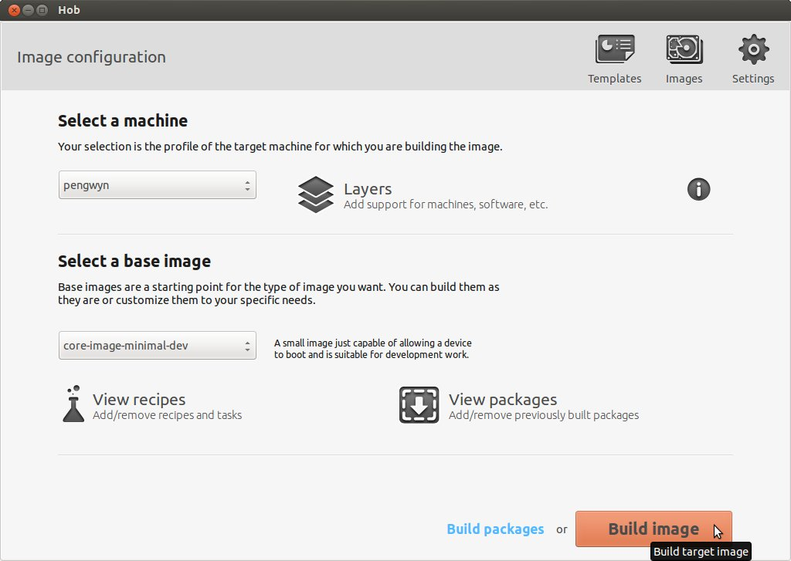

.. important::
	The build process can last hours.

Wait until it finishes.

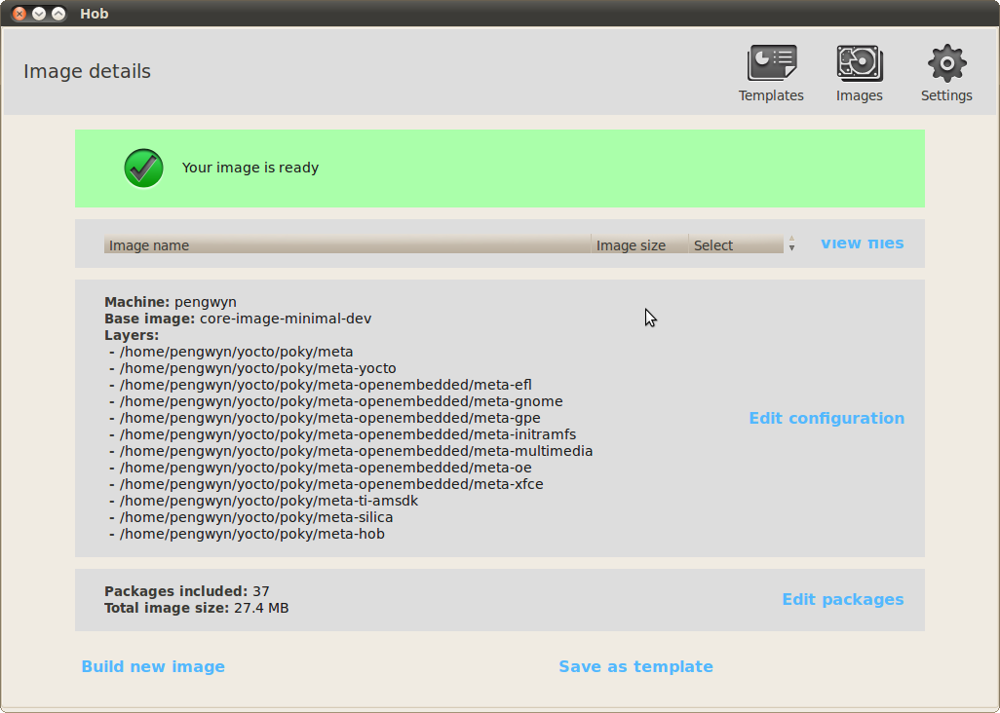

At the end of the build the images will be automatically saved in */home/pengwyn/yocto/build/tmp/deploy/images* folder.

Create your SD card
-------------------

.. important::
	You must have an SD card reader/programmer to build the SD card.
	The SD card must be at the least 1GB size.
	VirtualBox will see only USB connected SD card reader/programmer. This guide will assume you have a USB device for such a purpose.

To create your SD card, please follow these steps:

* Connect your SD card reader to your computer than to the virtual machine, from VirtualBox menu select Devices → USB Devices → "your SDcard reader".
* Insert the SD card into the adapter (in this example we are inserting an SD card already partitioned with a FAT and an EXT2 partition, that is the basic configuration for the Pengwyn board).
* Download the tool scripts (download link `pengwyn-tools.tar.bz2 <_static/pengwyn-tools.tar.bz2>`_) and decompress in a folder. eg:

.. raw:: html

 

 
<b class="admonition-host">&nbsp;&nbsp;Host&nbsp;&nbsp;</b>&nbsp;&nbsp;<a style="float: right;" href="javascript:select_text( 'quick_rst-host-111' );">select</a>

 <pre class="line-numbers pre-replacer" data-start="1"><code id="quick_rst-host-111" class="language-markup">tar -jxf pengwyn-tools.tar.bz2 -C /home/architech/Desktop</code></pre>
 
 
 

* Run the following command

.. raw:: html

 

 
<b class="admonition-host">&nbsp;&nbsp;Host&nbsp;&nbsp;</b>&nbsp;&nbsp;<a style="float: right;" href="javascript:select_text( 'quick_rst-host-112' );">select</a>

 <pre class="line-numbers pre-replacer" data-start="1"><code id="quick_rst-host-112" class="language-markup">~$ sudo fdisk -l
 
 Disk /dev/sdb: 1971 MB, 1971322880 bytes
 255 heads, 63 sectors/track, 239 cylinders
 Units = cylinders of 16065 * 512 = 8225280 bytes
 Sector size (logical/physical): 512 bytes / 512 bytes
 I/O size (minimum/optimal): 512 bytes / 512 bytes
 Disk identifier: 0x9bfa2153
 
 Device Boot      Start         End      Blocks   Id  System
 /dev/sdb1   *           1           9       72261    c  W95 FAT32 (LBA)
 /dev/sdb2              11         239     1839442+  83  Linux</code></pre>
 
 
 

* Find the device name from fdisk command output, in this example is **/dev/sdb**.

* Run the script that will prepare the SD card with all the needed files (sudo password: **architech**)

.. raw:: html

 

 
<b class="admonition-host">&nbsp;&nbsp;Host&nbsp;&nbsp;</b>&nbsp;&nbsp;<a style="float: right;" href="javascript:select_text( 'quick_rst-host-113' );">select</a>

 <pre class="line-numbers pre-replacer" data-start="1"><code id="quick_rst-host-113" class="language-markup">cd /home/architech/Desktop/pengwyn-tools
 sudo ./fast-create-sdcard.sh</code></pre>
 
 
 

| When the script starts asks for the :index:`sudo password`, type **architech** followed by enter-key.
| The list of available devices will be shown: the SD card should be the number **1** of the list with name sdb. Check the size shown on the table to be sure that the device is the correct one. Enter the device number **1** followed by enter-key.

.. raw:: html

 

 
<b class="admonition-host">&nbsp;&nbsp;Host&nbsp;&nbsp;</b>&nbsp;&nbsp;<a style="float: right;" href="javascript:select_text( 'quick_rst-host-114' );">select</a>

 <pre class="line-numbers pre-replacer" data-start="1"><code id="quick_rst-host-114" class="language-markup">+------------------------------------------------------------------------------+
 |                                                                              |
 | This script will create a bootable SD card.                                  |
 | The script must be run with root permissions.                                |
 |                                                                              |
 +------------------------------------------------------------------------------+
 
 
 +------------------------------------------------------------------------------+
 | LIST OF AVAILABLE DRIVES:                                                    |
 +------------------------------------------------------------------------------+
 
 #  major   minor    size   name
 1:   8       16    1927168 sdb
 
 Enter Device Number #:</code></pre>
 
 
 

| The script will create two partitions on the SD card: the first one is a **FAT32** with the **boot files**, the second one is an **ext3** with the **target file system**.
| The operations will take few minutes.

.. raw:: html

 

 
<b class="admonition-host">&nbsp;&nbsp;Host&nbsp;&nbsp;</b>&nbsp;&nbsp;<a style="float: right;" href="javascript:select_text( 'quick_rst-host-115' );">select</a>

 <pre class="line-numbers pre-replacer" data-start="1"><code id="quick_rst-host-115" class="language-markup">+------------------------------------------------------------------------------+
 |                                                                              |
 | This script will create a bootable SD card.                                  |
 | The script must be run with root permissions.                                |
 |                                                                              |
 +------------------------------------------------------------------------------+
 
 
 +------------------------------------------------------------------------------+
 | LIST OF AVAILABLE DRIVES:                                                    |
 +------------------------------------------------------------------------------+
 
 #  major   minor    size   name
 1:   8       16    1927168 sdb
 
 Enter Device Number #: 1
 
 sdb was selected
 
 sdb1  sdb2
 72261 1839442
 
 Mount the partitions
 Emptying partitions
 Syncing....
 
 +------------------------------------------------------------------------------+
 |	Copying files now... will take minutes				       |
 +------------------------------------------------------------------------------+
 
 Copying boot partition
 Copying file system partition
 Copying modules
 Syncing....
 Un-mount the partitions
 Remove created temp directories
 Operation Finished
 
 Press ENTER to finish</code></pre>
 
 
 

* Remove the SDcard

Run your first Application on Pengwyn board!
--------------------------------------------

Launch Eclipse using Architech Splashscreen just click on **Develop with Eclipse**.

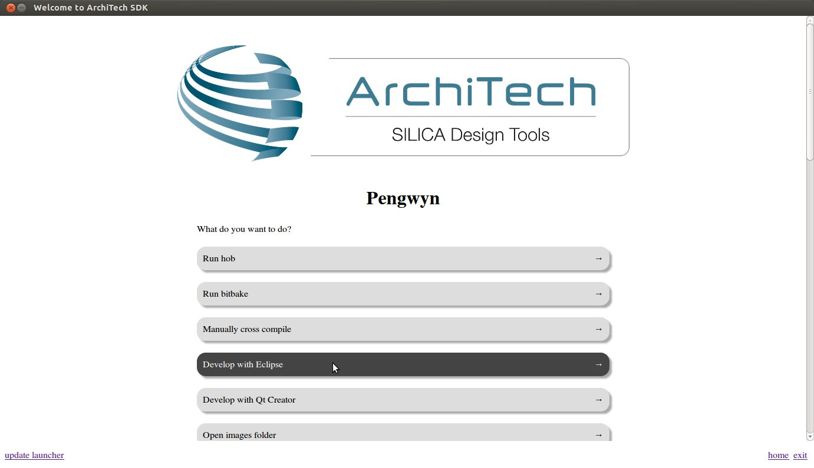

To create a project based on a Yocto template and then display the source code, follow these steps:

* Select File→New→Project...
* Under *C/C++*, double click on *C Project* to create the project.
* Expand *Yocto ADT Project*.
* Select *Hello World ANSI C Autotools Project*. This is an Autotools-based project based on a Yocto Project template.

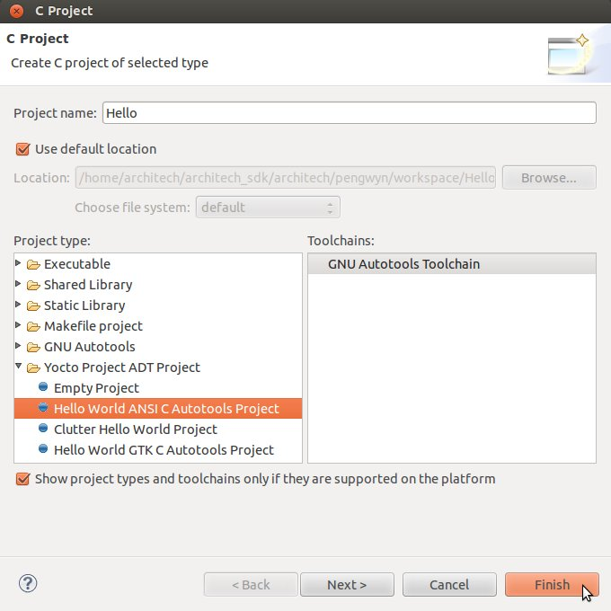

* Put a name in the Project *name:* field. Do not use hyphens as part of the name.
* Click *Next*.
* Add information in the *Author* and *Copyright* notice fields.
* Be sure the *License* field is correct.
* Click *Finish*.

**Note:** If the "open perspective" prompt appears, click *Yes* so that you enter in the C/C++ perspective.
The left-hand navigation pane shows your project. You can display your source by double clicking the project's source file.

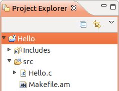

Building the Project
--------------------

To build the project, select Project→Build Project. The console should update with messages from the cross-compiler.
To add more libraries to compile:

* Click on Project→Properties.
* Expand the box next to Autotools.
* Select Configure Settings.
* In CFLAGS field, you can add the path of includes with -Ipath_include
* In LDFLAGS field, you can specify the libraries you use with -lname_library and you can also specify the path where to look for libraries with -Lpath_library

**Note:** All libraries are located in *~/architech_sdk/architech/pengwyn/sysroot* subdirectories.

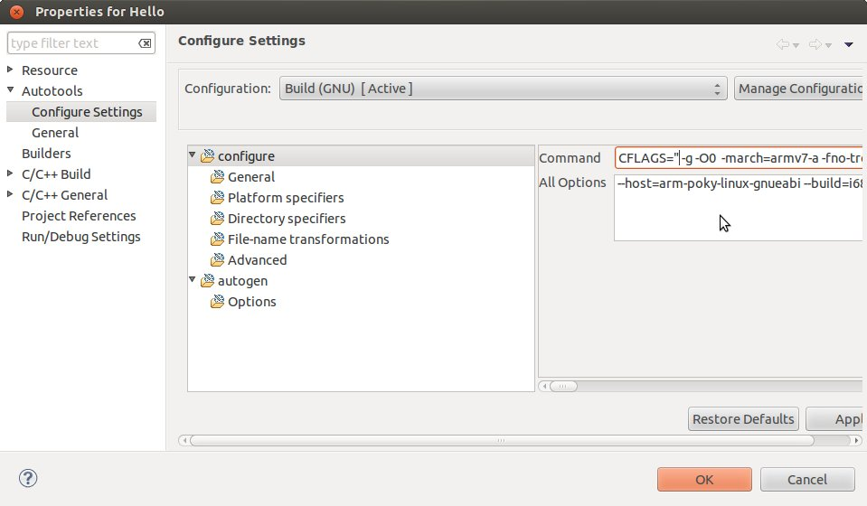

.. index:: Debug

Deploying and Debugging the Application
---------------------------------------

Connect the Pengwyn board to the PC by means of a usb cable to power the board and to have the serial console

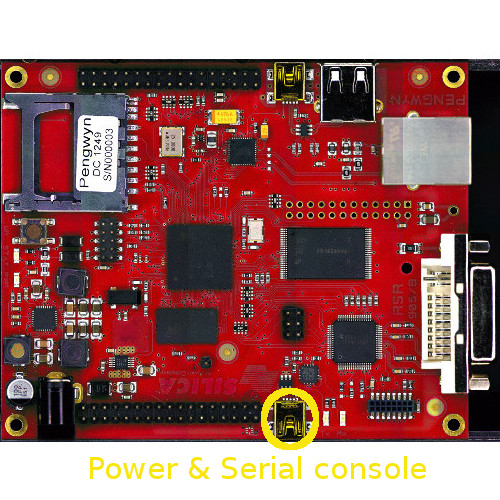

Once you built the project and the board is running the image, use minicom (refer to section :ref:`usbSerial` to know how to configure minicom) to run **tcf-agent** program in target board:

.. raw:: html

 

 
<b class="admonition-board">&nbsp;&nbsp;Board&nbsp;&nbsp;</b>&nbsp;&nbsp;<a style="float: right;" href="javascript:select_text( 'quick_rst-board-191' );">select</a>

 <pre class="line-numbers pre-replacer" data-start="1"><code id="quick_rst-board-191" class="language-markup">Yocto (Built by Poky 7.0.1) 1.2.1
  ttyO0
 
 pengwyn login: root
 root@pengwyn:~# ifconfig eth0 192.168.0.10</code></pre>
 
 
 

Test the ethernet:

.. raw:: html

 

 
<b class="admonition-board">&nbsp;&nbsp;Board&nbsp;&nbsp;</b>&nbsp;&nbsp;<a style="float: right;" href="javascript:select_text( 'quick_rst-board-192' );">select</a>

 <pre class="line-numbers pre-replacer" data-start="1"><code id="quick_rst-board-192" class="language-markup">ping 192.168.0.100</code></pre>
 
 
 

If the output is similar to this one:

.. raw:: html

 

 
<b class="admonition-board">&nbsp;&nbsp;Board&nbsp;&nbsp;</b>&nbsp;&nbsp;<a style="float: right;" href="javascript:select_text( 'quick_rst-board-193' );">select</a>

 <pre class="line-numbers pre-replacer" data-start="1"><code id="quick_rst-board-193" class="language-markup">64 bytes from 192.168.0.100: icmp_req=1 ttl=64 time=0.946 ms
 64 bytes from 192.168.0.100: icmp_req=2 ttl=64 time=0.763 ms
 64 bytes from 192.168.0.100: icmp_req=3 ttl=64 time=0.671 ms
 64 bytes from 192.168.0.100: icmp_req=4 ttl=64 time=0.793 ms</code></pre>
 
 
 

the ethernet connection is ok, then run command:

.. raw:: html

 

 
<b class="admonition-board">&nbsp;&nbsp;Board&nbsp;&nbsp;</b>&nbsp;&nbsp;<a style="float: right;" href="javascript:select_text( 'quick_rst-board-194' );">select</a>

 <pre class="line-numbers pre-replacer" data-start="1"><code id="quick_rst-board-194" class="language-markup">/etc/init.d/tcf-agent restart</code></pre>
 
 
 

On the Host machine, follow these steps to let **Eclipse** deploy and debug your application:

* Select *Remote System Explorer* perspective.

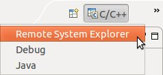

* In *Remote System* area right-click TCF icon and select *Property*.

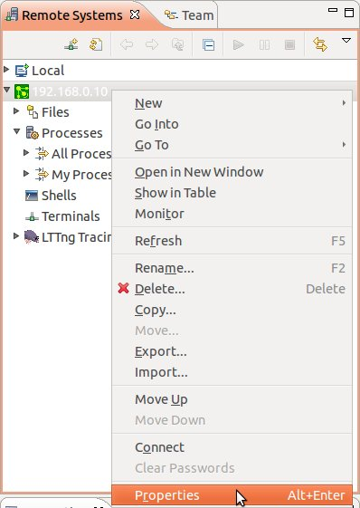

* In *Host* tab, insert in *Host Name* and *Connection Name* fields the IP address of the target board. (e.g. 192.168.0.10)

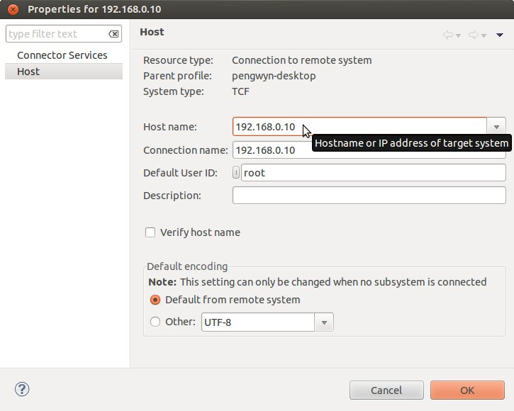

* Then press *OK*.
* Select Run→Debug Configurations...
* In the left area, expand *C/C++Remote Application*.
* Locate your project and select it to bring up a new tabbed view in the *Debug Configurations* Dialog.

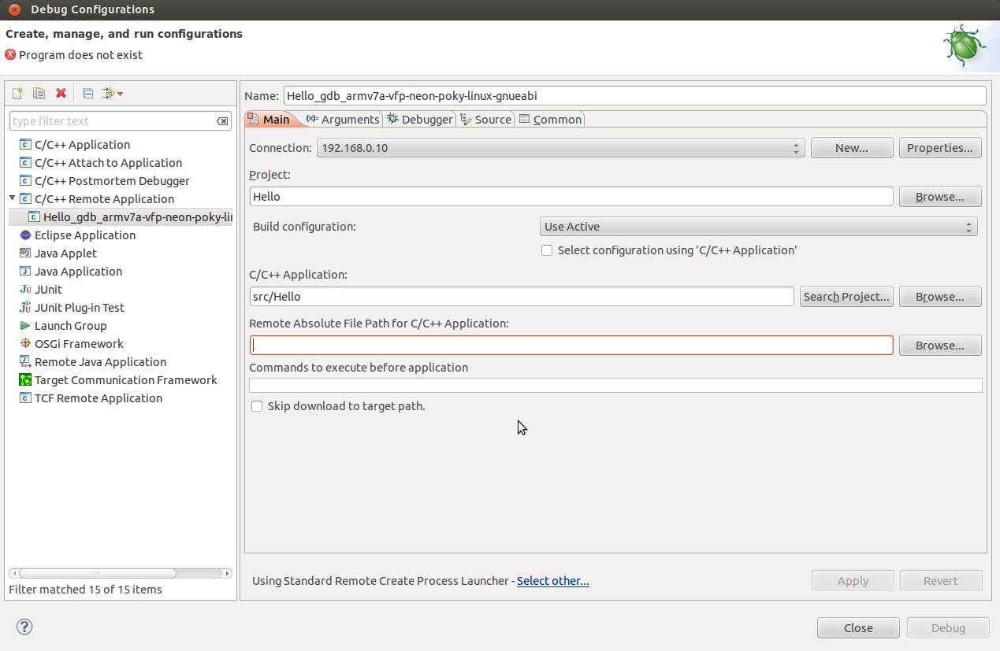

* Use the drop-down menu now in the *Connection* field and pick the IP Address you entered earlier.
* Enter the absolute path on the target into which you want to deploy the application. Use the *Browse* button near *Remote Absolute File Path for C/C++Application:* field. No password is needed.

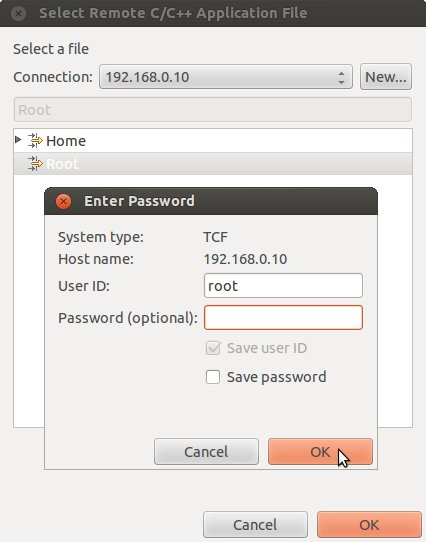

* Enter also in the path the name of the application you want to build. (e.g. Hello)

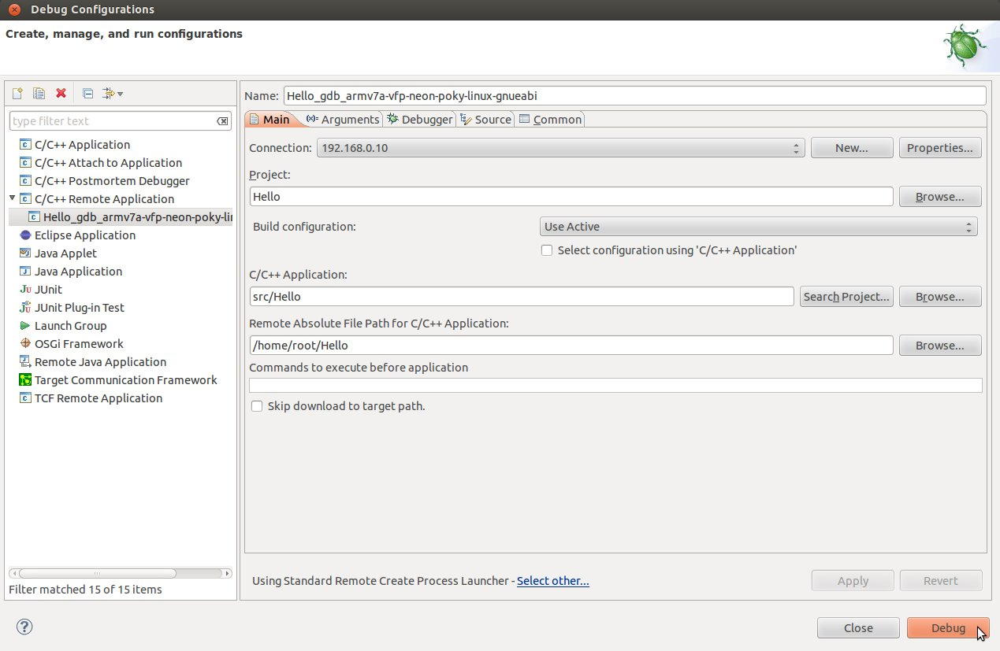

.. important::

	If debug does not works, check if tcf-agent is running on the board and gdbserver is present.

| Click *Debug* to bring up a login screen and login as root.
| Accept the debug perspective. 

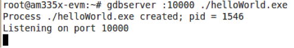

With **F6** key you can execute the application **step by step**. You can see the target output in the eclipse *console view*

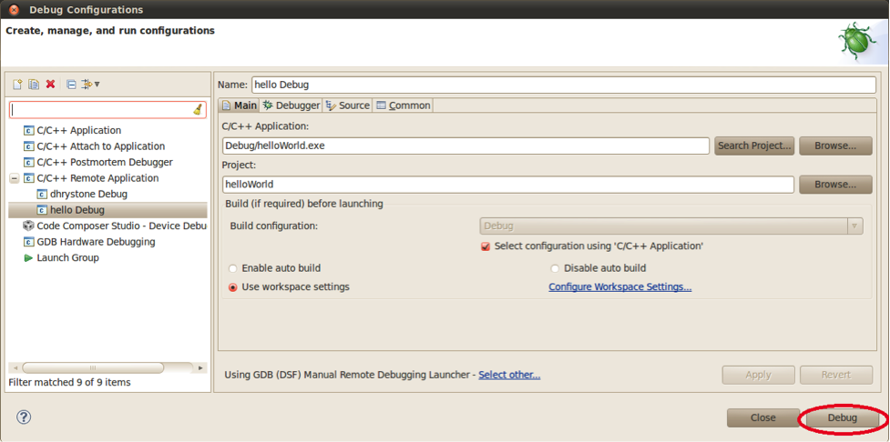