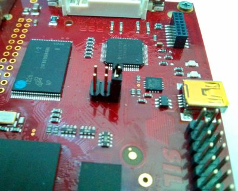

First of all, make sure the board can boot entirely from the SD-Card by setting **J1** closed and **J2** and **J3** opened:

Pengwyn takes the power from the mini-USB connector **CN6** and/or connector **CN1**.

Now it's time to start the serial console.

.. include:: serial_console.rst

Give *root* to the login prompt:

.. board::

 pengwyn login: root

and press *Enter*.

.. note::

 Sometimes, the time you spend setting up minicom makes you miss all the output that leads to the login and you see just a black screen, press *Enter* then to get the login prompt.

