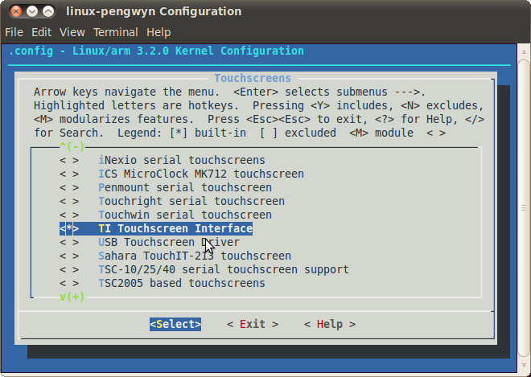

How to add 3"5 display with touch screen
========================================

This procedure will guide you to the installation of the display on the Pengwyn board and the configuration of the software to test it.

.. image:: _static/display-1.png

Installing the board
--------------------

1. switch off the board

2. connect display

.. image:: _static/display-2.png

3. switch on the board

Installing the software
-----------------------

1. run **VirtualBox** and start the virtual machine

2. download the display patch (ref. `linux-pengwyn_3.2.display.patch.tar.gz <http://downloads.architechboards.com/pengwyn/updates/linux-pengwyn_3.2.display.patch.tar.gz>`_ ) and save the file to **/home/architech/architech_sdk/architech/pengwyn** folder

3. open terminal and decompress patch

.. raw:: html

 

 
<b class="admonition-host">&nbsp;&nbsp;Host&nbsp;&nbsp;</b>&nbsp;&nbsp;<a style="float: right;" href="javascript:select_text( 'touch_rst-host-31' );">select</a>

 <pre class="line-numbers pre-replacer" data-start="1"><code id="touch_rst-host-31" class="language-markup">cd /home/architech/architech_sdk/architech/pengwyn
 tar xvf linux-pengwyn_3.2.display.patch.tar.gz</code></pre>
 
 
 

4. change kernel configuration, adding **TI touch screen driver**

.. raw:: html

 

 
<b class="admonition-host">&nbsp;&nbsp;Host&nbsp;&nbsp;</b>&nbsp;&nbsp;<a style="float: right;" href="javascript:select_text( 'touch_rst-host-32' );">select</a>

 <pre class="line-numbers pre-replacer" data-start="1"><code id="touch_rst-host-32" class="language-markup">cd yocto
 source poky/oe-init-build-env
 bitbake linux-pengwyn -c cleanall
 bitbake linux-pengwyn -c menuconfig</code></pre>
 
 
 

.. image:: _static/touch-cfg-1.png

.. image:: _static/touch-cfg-2.png

.. image:: _static/touch-cfg-3.png

5. compile the kernel

.. raw:: html

 

 
<b class="admonition-host">&nbsp;&nbsp;Host&nbsp;&nbsp;</b>&nbsp;&nbsp;<a style="float: right;" href="javascript:select_text( 'touch_rst-host-33' );">select</a>

 <pre class="line-numbers pre-replacer" data-start="1"><code id="touch_rst-host-33" class="language-markup">bitbake linux-pengwyn</code></pre>
 
 
 

6. run **HOB**

7. select **Pengwyn** target and **qt4demo**

8. build 

9. run **SD card creator**

10. insert SDcard on Pengwyn board and wait Linux start-up

11. first time, **the touch screen calibration is needed**, than qt4 demo will start
