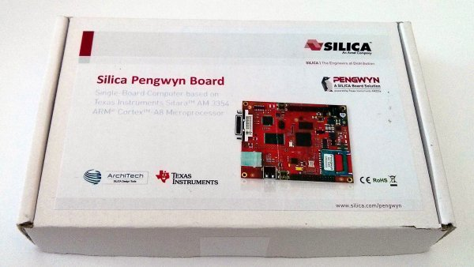
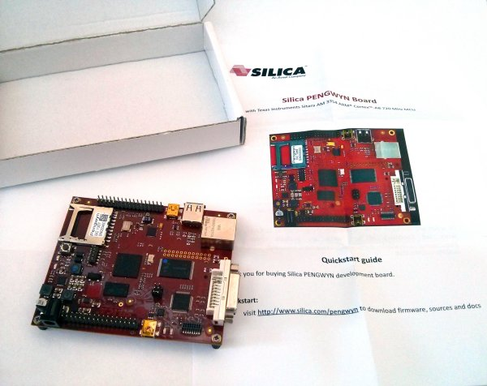
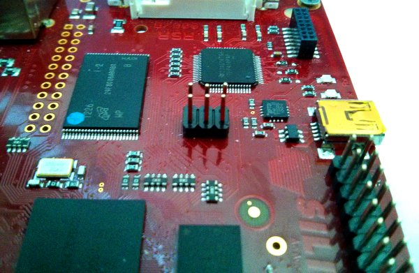

.. _unboxing_label:

Unboxing
^^^^^^^^

This powerful board comes with this beautiful box

Pengwyn takes the power from the mini-USB connector **CN6** and/or connector **CN1**. The board is not shipped with an external power adapter.

The NAN* on the board has been programmed to let Pengwyn boot a *qt4e-demo-image-pengwyn* image generated with Yocto.

What are we waiting for? Lets boot the board!

1. First of all, make sure the board can boot entirely from the NAND by setting **J1**, **J2** and **J3** opened:

2. Connect the DVI-D connector **CN11** to your monitor/television by means of an DVI-D cable

3. Shall we power on the board for the first time? Of course!

.. include:: serial_console.rst

Give *root* to the login prompt:

.. board::

 pengwyn login: root

and press *Enter*.

.. note::

 Sometimes, the time you spend setting up minicom makes you miss all the output that leads to the login and you see just a black screen, press enter then to get the login prompt.

Enjoy!